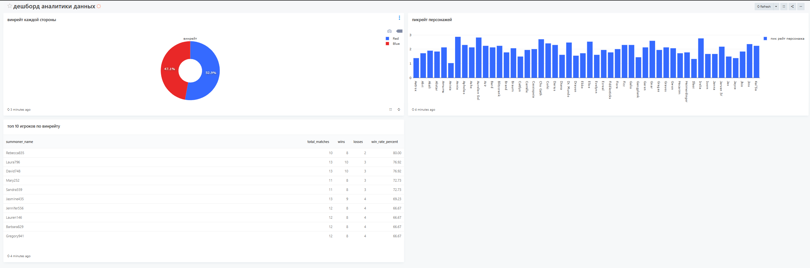

## Аналитика данных

Лабораторная работа по аналитике данных
Я создал postgres БД для хранения данных, python генератор для их генерации, 
Redash и jupyter notebook для анализа данных

# Установка на системе
1. Склонируйте репозиторий на вашу систему:
```bash
git clone https://github.com/abbeswrld/Data-analytics
```

2. Создать файл .env, заполнить его вашими данными

3. Запустить контейнеры: 
```bash
docker compose up -d
```

# Скрины с Редаша


